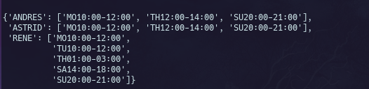

IOET challenge interview
=======


### In this part the best decission is use the power of the regular expressions
```
schedule = dict()
    
for x in file:
    name = re.search(r'\w{4,}', x)
    content = re.findall(r'\=(.*)', x)
    schedule[name.group()] = content[0].split(",")


name : RENE
content : ['MO10:00-12:00', 'TU10:00-12:00', 'TH01:00-03:00', 'SA14:00-18:00', 'SU20:00-21:00']

name : ASTRID
content : ['MO10:00-12:00', 'TH12:00-14:00', 'SU20:00-21:00']

name : ANDRES
content : ['MO10:00-12:00', 'TH12:00-14:00', 'SU20:00-21:00']

```

### This is the output.
